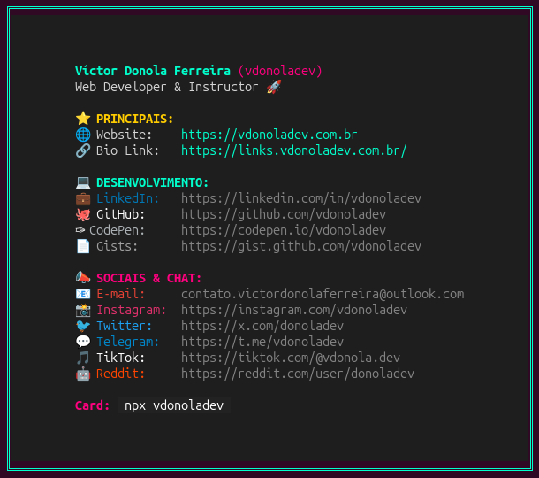

# 🚀 Projeto: vdonoladev (Personal NPX Card)

Como desenvolvedor web, sempre busco formas criativas e eficientes de centralizar minhas informações de contato, redes sociais e portfólio. Foi assim que nasceu o **`vdonoladev`**, um cartão de visitas interativo que roda diretamente no terminal através do comando `npx`.

A ideia principal foi criar um hub acessível para qualquer pessoa que queira conhecer meu trabalho ou entrar em contato comigo, sem que ela precise necessariamente abrir um navegador e digitar uma URL tradicional. Basta uma linha de comando.

---

## 📸 Demonstração do Projeto



---

## 🛠️ O que o projeto faz?

Ao rodar `npx vdonoladev` no terminal, o usuário se depara com um cartão estilizado em blocos e categorias, acompanhado de um menu interativo. Usando as setas do teclado e a tecla _Enter_, é possível disparar qualquer link (como meu site principal, GitHub, LinkedIn ou até abrir o cliente nativo de e-mail) diretamente no navegador padrão do sistema operacional.

---

## 💡 Desafios Técnicos e Aprendizados

Embora pareça um projeto simples na superfície, o desenvolvimento de ferramentas de CLI (Command Line Interface) interativas reserva grandes pegadinhas de arquitetura que exigiram soluções cirúrgicas:

### 1. O Isolamento de TTY e Ferramentas de Watch

Durante o fluxo de desenvolvimento no Linux (Ubuntu/Pop!\_OS), enfrentei um comportamento onde ferramentas de autoreload (como o `nodemon` ou a flag `--watch` nativa do Node) isolavam os subprocessos e quebravam o mapeamento de TTY do terminal. Isso fazia com que o `inquirer` parasse de escutar as setas do teclado e cuspisse caracteres ANSI brutos (`^[[B`).

- **Solução:** Implementei um monitoramento interno discreto na aplicação usando a biblioteca `node-watch` direto no core do script, garantindo que o processo principal do Node.js rodasse de forma 100% limpa e com o teclado totalmente interativo.

### 2. A Matemática Invisível dos Emojis e Bytes ANSI

O pacote `boxen` mede a largura do texto baseado no comprimento bruto da string (`string.length`). No entanto, o motor gráfico de alguns terminais renderiza certos emojis (como `✉️` e `✈️`) ocupando a largura física de 2 caracteres, enquanto o Node os lê como 1 caractere devido ao byte oculto de variação de variante (`U+FE0F`). Além disso, aplicar cores com o `chalk` injeta metadados invisíveis que distorcem o cálculo da moldura, fazendo a borda lateral "vazar" ou quebrar para dentro.

- **Solução:** Substituí os emojis por variantes estáveis de largura fixa na renderização de fontes do sistema e isolei cirurgicamente os espaços em branco de indentação para fora das funções de estilo do Chalk, garantindo uma caixa perfeitamente simétrica e reta de cima a baixo.

---

## 🧰 Stack Utilizada

O script adota o ecossistema moderno do Node.js com a sintaxe nativa de **ES Modules (`import/export`)**:

- **`inquirer`**: Gerenciamento da interface CLI interativa de perguntas e respostas.
- **`chalk`**: Injeção de cores ANSI customizadas e paleta hexadecimal vibrante para contraste em temas escuros.
- **`boxen`**: Renderização da estrutura de bordas duplas e estilização do container.
- **`open`**: Ponte com o sistema operacional para abrir instâncias do navegador padrão do usuário.

---

## 🕹️ Teste Agora Mesmo

O pacote está publicado globalmente no registro do NPM e você pode testá-lo em qualquer terminal com suporte a Node.js executando:

```bash
npx vdonoladev
```

O código-fonte completo, a licença MIT e a documentação detalhada de desenvolvimento local estão disponíveis no meu repositório do [GitHub](https://github.com/vdonoladev/npxCard).
